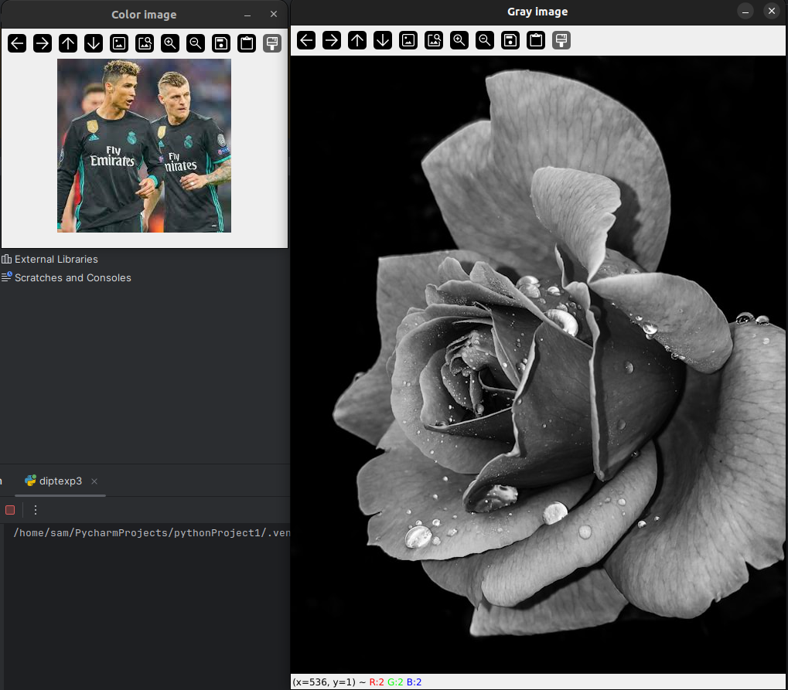
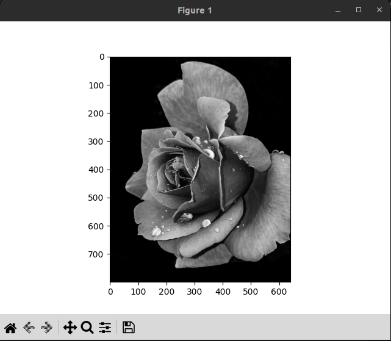
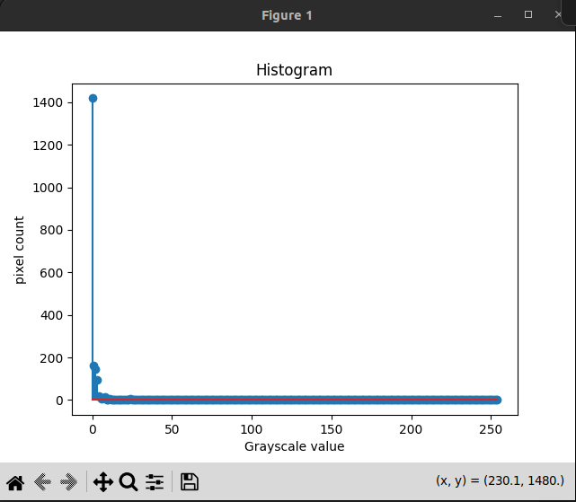
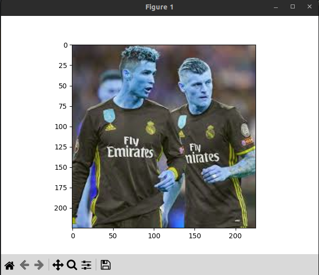
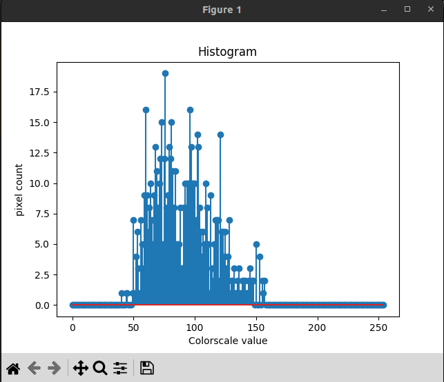
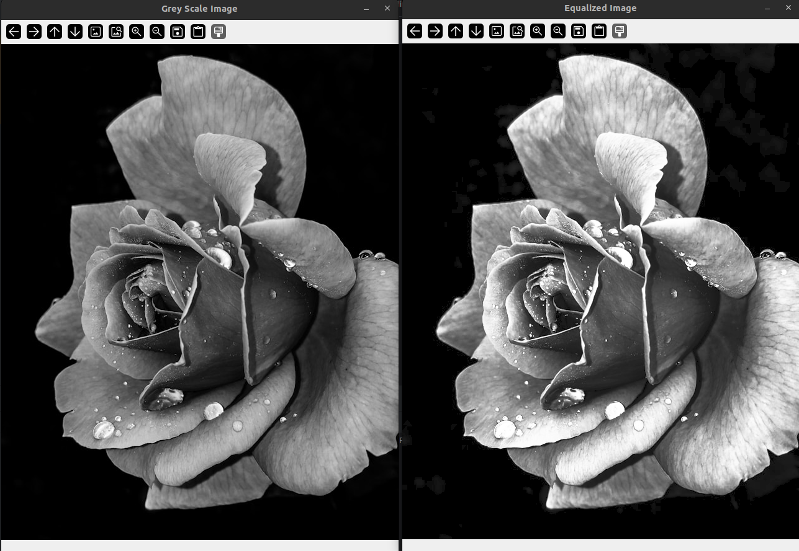

# Histogram-of-an-images
## Aim
To obtain a histogram for finding the frequency of pixels in an Image with pixel values ranging from 0 to 255. Also write the code using OpenCV to perform histogram equalization.

## Software Required:
Anaconda - Python 3.7

## Algorithm:
### Step1:
Read the gray and color image using imread()

### Step2:
Print the image using imshow().


### Step3:
Use calcHist() function to mark the image in graph frequency for gray and color image.

### step4:
Use calcHist() function to mark the image in graph frequency for gray and color image.

### Step5:
The Histogram of gray scale image and color image is shown.


## Program:

#### Developed By: Sam Israel D
#### Register Number: 212222230128
```python
import cv2
import matplotlib.pyplot as plt
gray_image = cv2.imread('flower.jpg')
color_image = cv2.imread('cr7tk8.jpeg')
cv2.imshow("Gray image",gray_image)
cv2.imshow("color image",color_image)
cv2.waitKey(0)
cv2.destroyAllWindows()
```
```python
import numpy as np
gray_image=cv2.imread('flower.jpg')
import matplotlib.pyplot as plt 
gray_hist=cv2.calcHist(gray_image,[0],None,[255],[0,255])
plt.figure()
plt.imshow(gray_image)
plt.show()
plt.title("Histogram")
plt.xlabel("Grayscale value")
plt.ylabel("pixel count")
plt.stem(gray_hist)
plt.show()
```
```python
import numpy as np
color_image=cv2.imread('cr7tk8.jpeg')
import matplotlib.pyplot as plt 
color_hist=cv2.calcHist(color_image,[0],None,[255],[0,255])
plt.figure()
plt.imshow(color_image)
plt.show()
plt.title("Histogram")
plt.xlabel("Colorscale value")
plt.ylabel("pixel count")
plt.stem(color_hist)
plt.show()
```
```python
import cv2
gray_image = cv2.imread("flower.jpg",0)
cv2.imshow('Grey Scale Image',gray_image)
equ = cv2.equalizeHist(gray_image)
cv2.imshow("Equalized Image",equ)
cv2.waitKey(0)
cv2.destroyAllWindows()
```
## Output:
### Input Grayscale Image and Color Image

### Histogram of Grayscale Image and any channel of Color Image


### Histogram Equalization of Grayscale Image.

## Result: 
Thus the histogram for finding the frequency of pixels in an image with pixel values ranging from 0 to 255 is obtained. Also,histogram equalization is done for the gray scale image using OpenCV.
